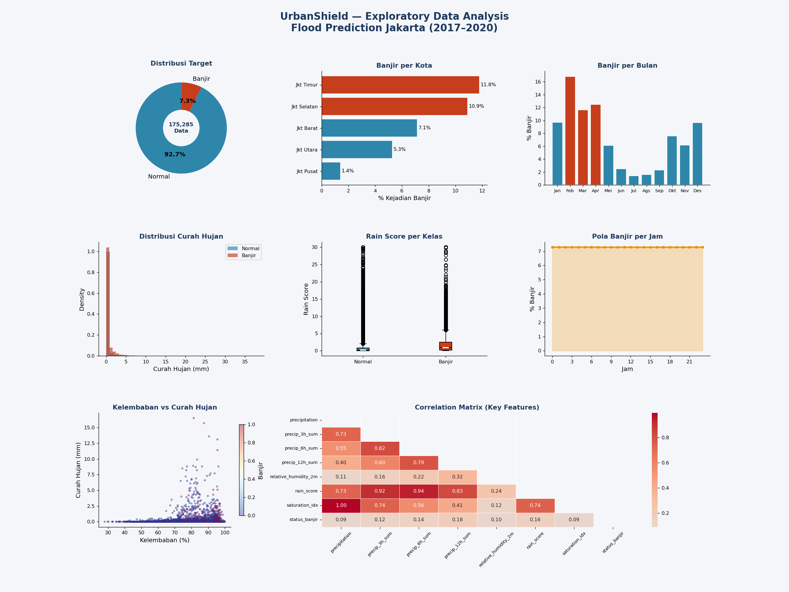
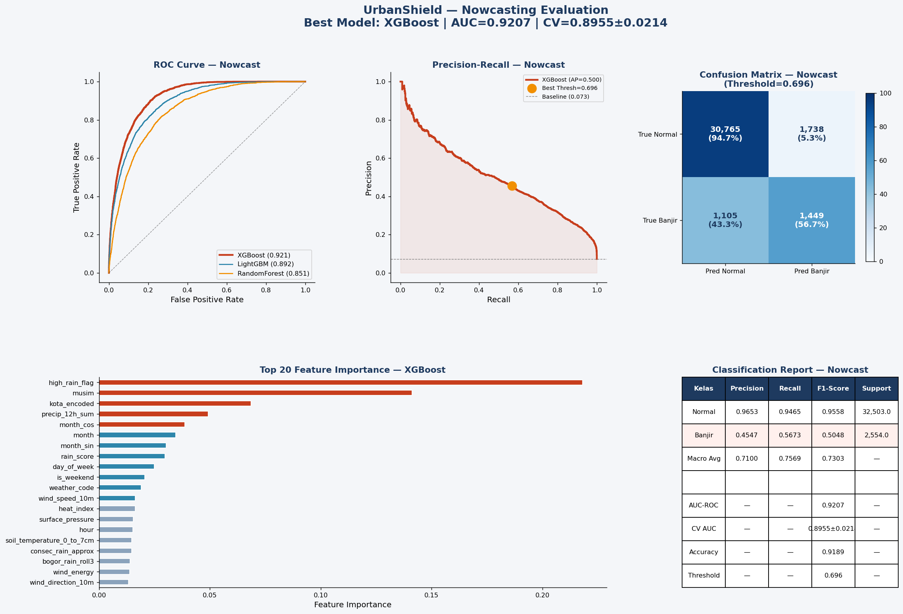
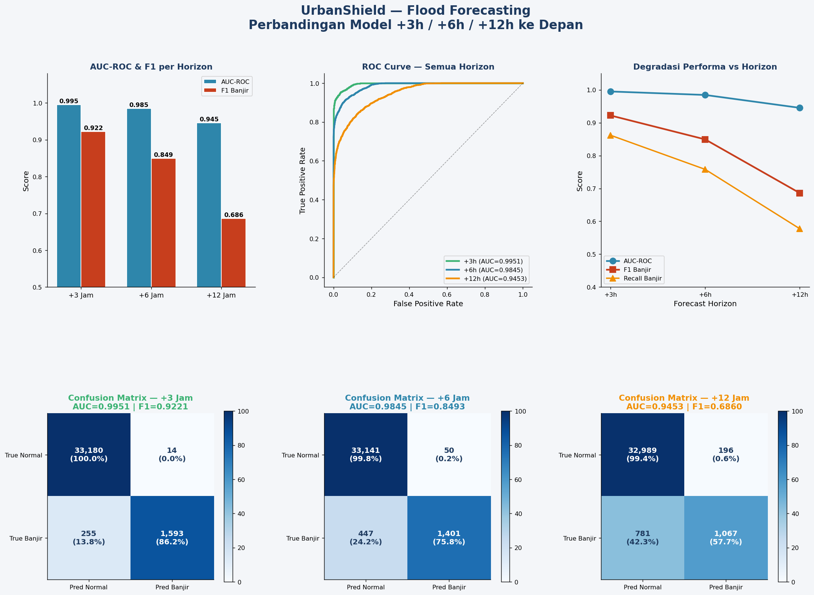
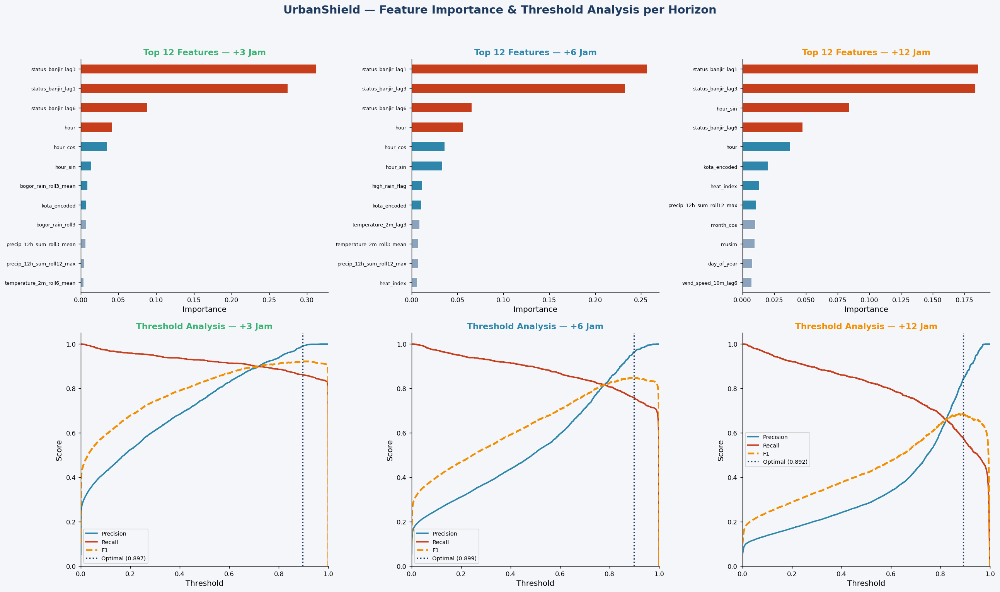

# 🛡️ UrbanShield 2.0 Logistics OS
### *Sistem Operasi Navigasi & Pemantauan Armada Berbasis AI*

> Sistem peringatan dini banjir kelas Enterprise dan rekomendasi rute evakuasi logistik real-time — dibangun untuk **AI Impact Challenge · Microsoft Elevate × Dicoding 2026**

[](https://nextjs.org/)
[](https://fastapi.tiangolo.com/)
[](https://tailwindcss.com/)
[](https://xgboost.readthedocs.io)

---

## 📌 Latar Belakang

Jakarta adalah salah satu kota dengan risiko banjir tertinggi di Asia Tenggara. Setiap tahunnya, banjir menyebabkan kerugian ekonomi raksasa pada sektor logistik dan menghambat mobilitas warga secara masif. Sistem peringatan yang ada saat ini sering kali bersifat reaktif, bukan prediktif.

**UrbanShield 2.0** hadir sebagai solusi *Logistics OS* (Sistem Operasi Logistik) berbasis AI terpadu. Bukan sekadar memberikan *early warning system*, UrbanShield **secara aktif menghitung risiko finansial kargo, memantau ratusan armada secara simultan, dan merekomendasikan rute evakuasi alternatif** via integrasi Azure Maps.

---

## 🎯 Fitur Utama Ekosistem

| Modul | Deskripsi |
|---|---|
| 📍 **Single Route Simulator** | Dasbor kalkulasi perlindungan finansial mikro dan re-routing cerdas untuk 1 unit perjalanan menggunakan Azure Maps. |
| 🌦️ **Meteorology Hub** | Pemantauan radar cuaca makro secara live, mendeteksi titik krusial Jabodetabek (termasuk Siaga Bendung Katulampa). |
| 🚛 **Fleet Command Center** | Pusat kendali skala enterprise. Menyimulasikan pemantauan massal **245 unit truk logistik** yang beroperasi secara bersamaan dengan fitur "Auto-Reroute" berbasis probabilitas banjir AI. |
| 📊 **Data Science Insights** | Ruang transparansi model ML. Menampilkan *Feature Importance* (SHAP) dinamis dan evaluasi metrik model XGBoost (Recharts). |
| 👨‍💻 **Developer API Portal** | Dokumentasi B2B interaktif. Mengizinkan perusahaan (contoh: Tokopedia, JNE) untuk menguji langsung API cURL ke backend FastAPI kita. |

---

## 🏗️ Arsitektur Sistem (Microservices)

```
┌─────────────────────────────────────────────────────────────┐
│                    DATA SOURCES (Input)                     │
│  Open-Meteo API (real-time)  │  BPBD Jakarta + Bogor Hulu   │
└────────────────┬────────────────────────────────────────────┘
                 │
                 ▼
┌─────────────────────────────────────────────────────────────┐
│                 BACKEND ENGINE (FastAPI)                    │
│  - Endpoint /api/route (Route Planning + Weather Injection) │
│  - Endpoint /api/predict (XGBoost Batch Inference)          │
│  - Azure Maps Fallback System (Robustness & Fault Tolerance)│
└────────────────┬────────────────────────────────────────────┘
                 │ JSON API / REST
                 ▼
┌─────────────────────────────────────────────────────────────┐
│                 FRONTEND APP (Next.js App Router)           │
│  - SSR & CSR Components                                     │
│  - Leaflet Dynamic Maps & Recharts Data Viz                 │
│  - Tailwind CSS (Glassmorphism & Cyber-Corporate Theme)     │
└─────────────────────────────────────────────────────────────┘
```

---

## 🤖 Model Machine Learning

Empat model XGBoost ditraining secara terpisah dengan target horizon prediksi berbeda:

| Model | File | AUC | F1-Score (Banjir) | Threshold |
|---|---|---|---|---|
| Nowcast (T+0) | `model_nowcast_xgboost.pkl` | 0.9185 | 0.5133 | 0.20 |
| Forecast +3 Jam | `model_forecast_3h.pkl` | 0.9951 | 0.9188 | 0.35 |
| Forecast +6 Jam | `model_forecast_6h.pkl` | 0.9841 | 0.8456 | 0.35 |
| Forecast +12 Jam | `model_forecast_12h.pkl` | 0.9429 | 0.6827 | 0.40 |

### 📈 Visualisasi Evaluasi Model

#### 1. Exploratory Data Analysis (EDA) Overview

*Analisis distribusi data (131k+ baris) menunjukkan korelasi kuat antara akumulasi hujan dan kejadian banjir.*

#### 2. Evaluasi Model Nowcast

*Evaluasi akurasi Nowcast secara real-time.*

#### 3. Perbandingan Performa antar Horizon

*Model +3 Jam menunjukkan performa terbaik, sementara performa berdegradasi wajar seiring bertambahnya horizon waktu.*

#### 4. Analisis Feature Importance & Threshold

*Fitur lag (kondisi sebelumnya), elevasi tanah, dan curah hujan hulu (Bogor) menjadi prediktor terkuat AI.*

---

## 📂 Struktur Repositori

```
UrbanShield/
│
├── backend/                     # API Microservice
│   ├── main.py                  # Entry point FastAPI
│   ├── features.py              # Logic ekstraksi fitur XGBoost
│   ├── azure_maps.py            # Modul routing & fallback Azure Maps
│   └── requirements.txt         
│
├── frontend/                    # Aplikasi Antarmuka Web
│   ├── src/app/                 # Next.js App Router (Halaman & Rute)
│   ├── src/components/          # Reusable React components (Map, Sidebar)
│   ├── package.json             
│   └── globals.css              # Cyber-Corporate Styling
│
├── notebooks/                   # R&D Data Science
│   ├── 2_datathon_prepros.py    
│   ├── 3_UrbanShield_Code.ipynb # Pembuatan Model Utama
│   └── visuals/                 # Gambar evaluasi untuk dokumentasi
│
├── data/                        # CSV mentah dan Data Latih
└── models/                      # .pkl file pre-trained XGBoost
```

---

## 🚀 Cara Menjalankan Lokal

Karena aplikasi sekarang mengadopsi arsitektur terpisah, Anda harus menjalankan Backend dan Frontend secara bersamaan.

### 1. Jalankan Backend (FastAPI)
Buka terminal pertama, lalu arahkan ke folder backend:
```bash
cd backend
pip install -r requirements.txt
uvicorn main:app --reload --port 8000
```
Backend akan berjalan di `http://127.0.0.1:8000`.

### 2. Jalankan Frontend (Next.js)
Buka terminal kedua, lalu arahkan ke folder frontend:
```bash
cd frontend
npm install
npm run dev
```
Frontend akan berjalan di `http://localhost:3000`. Silakan buka tautan tersebut di browser Anda.

---

## 📊 Dataset (Diperbarui)

| Dataset | Sumber | Periode | Keterangan |
|---|---|---|---|
| Rekap Kejadian Banjir | BPBD Jakarta / Satu Data Jakarta | 2017 - 2020 | Termasuk penambahan data 2018 untuk historical baseline yang lebih kuat. |
| Data Cuaca Jakarta & Bogor | Open-Meteo Historical API | 2017 - 2020 | Memasukkan cuaca Hulu Bogor (Katulampa) untuk memperkuat prediksi luapan air kiriman. |

---

## 👥 Tim

| Nama | GitHub |
|---|---|
| Horasio Nissi Immanuel | [@HorasioGit](https://github.com/HorasioGit) |
| Rizki Piji Fathoni | [@Rizki0907](https://github.com/Rizki0907) |

---

<p align="center">
  
  
</p>
